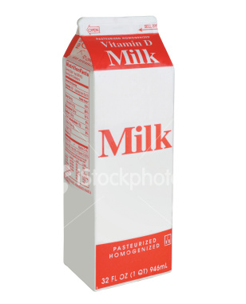
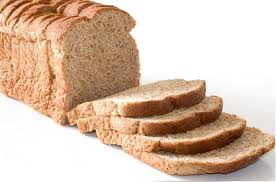

class
=====

Payment system class

1    <?php 
2    /** 
3     * Пример реализации продаж с помощью класса Onpay. 
4     * 
5     * @author norgen 
6     * @version 1.0 
7     * @namespace Onpay 
8     */ 
9     
10   /* 
11    * Если пришли данные формы, подключаем класс Onpay, создаем экземпляр класса 
12    * и инициализируем его. 
13    */ 
14    
15   require_once('onpay.class/onpay.class.php'); 
16    
17   //Данные авторизации в Onpay 
18   $onpay_form = 'form_name'; 
19   $onpay_key = 'key_for_api'; 
20    
21   //Работаем с внутренней базой класса. 
22   $mode = 'internal_db'; 
23    
24   // Создаем экземпляр класса Onpay и включаем отладку. 
25   $opy = new Onpay($mode, $onpay_form, $onpay_key); 
26   $opy->debug = true; 
27    
28    
29   // Если запрос содержит параметр type - перехватываем его и отправляем в процессор. 
30   // По всей вероятности это запрос от Onpay, дальнейшая валидация параметров производится классом. 
31   if (isset($_REQUEST['type'])) { 
32       if ($opy->process_onpay($_REQUEST)) { 
33           //Заказ успешно оплачлен, Onpay передан корректный XML, статус заказа сменен на "оплачено" можно что-то сделать 
34           //в пользовательском скрипте, например отправить email администратору/пользователю и прервать выполнение скрипта. 
35           exit; 
36       } else { 
37           //Есть какие-то ошибки, которые в данном примере передаются в onpay. Лучшим вариантом было бы отправить их 
38           //администратору или записать в лог. 
39           echo $opy->error;
40           exit; 
41       } 
42   } 
43    
44   if (isset($_REQUEST['product']) && isset($_REQUEST['price'])) { 
45    
46       // В идеале скрипт должен передавать еще и email покупателя, но для упрощения я использую свой. 
47       $email = 'vasily.norman@gmail.com'; 
48    
49       // Стоимость продукта 
50       $summ = $_REQUEST['price']; 
51    
52       // В переменную $form записывается js-скрипт, при выводе которого в браузер происходит редирект на платежную форму 
53       // Onpay с необходимыми параметрами. Одновременно происходит запись заказа во внутреннюю БД класса. 
54       $form = $opy->get_form('redirect', $summ, $email); 
55    
56       // Номер последнего заказа в этой сессии можно извлечь коммандой get_last_order(). Эта строчка не обязательна. 
57       echo "Redirect to pay for the order №" . $opy->get_last_order(); 
58    
59       // Выводим в браузер, который делает редирект на платежную форму Onpay. 
60       echo $form; 
61   } else { 
62       ?> 
63    
64   <!DOCTYPE HTML PUBLIC "-//W3C//DTD HTML 4.01 Transitional//EN" "http://www.w3.org/TR/html4/loose.dtd"> 
65   <html lang="en"> 
66   <head> 
67       <meta http-equiv="Content-Type" content="text/html;charset=UTF-8"> 
68       <title>Тестовый магазин на базе класса Onpay</title> 
69        
85   </head> 
86   <body> 
87   <h1>Тестовый магазин на базе класса Onpay</h1> 
88   <table> 
89       <tr> 
90           <td> 
91               <h2>Молоко</h2> 
92                
93    
94               <h3>200 руб.</h3><a href="?product=1&price=200">Купить через Onpay!</a> 
95           </td> 
96           <td> 
97               <h2>Кофе</h2> 
98                
99    
100              <h3>120 руб.</h3><a href="?product=2&price=120">Купить через Onpay!</a> 
101          </td> 
102      </tr> 
103      <tr> 
104          <td> 
105              <h2>Чай</h2> 
106               
107   
108              <h3>50 руб.</h3><a href="?product=3&price=50">Купить через Onpay!</a> 
109          </td> 
110          <td> 
111              <h2>Хлеб</h2> 
112               
113   
114              <h3>15 руб. 50 коп.</h3><a href="?product=2&price=15.50">Купить через Onpay!</a> 
115          </td> 
116      </tr> 
117  </table> 
118  <small><a target="_blank" href="source.html">Просмотреть исходный код с комментариями</a></small> 
119  </body> 
120  </html> 
121   
122  <? } ?>
